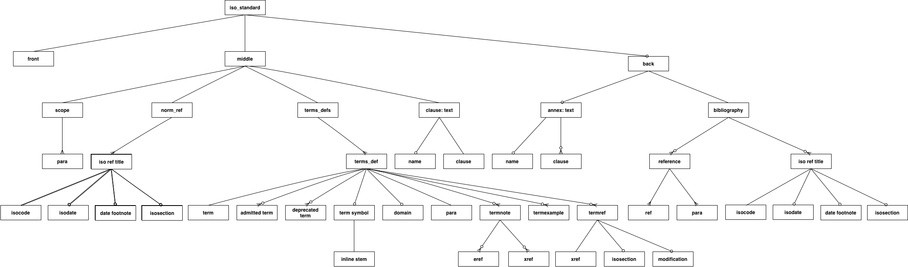
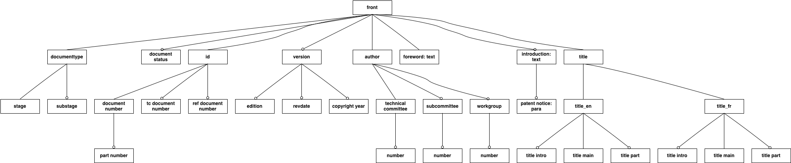
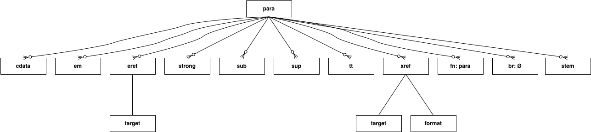
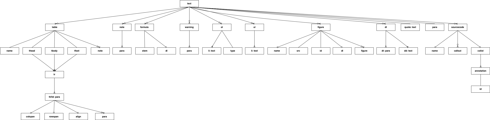

# ribose-iso
= Asciidoctor processor for ISO standards

This gem processes http://asciidoctor.org/[Asciidoctor] documents and outputs an XML representation of the document, intended as a document model for ISO International Standards. The XML representation can then be processed in turn to generate PDF or Microsoft Word output (via DocBook).

The document model intends to introduce rigour into the ISO standards authoring process; the existing https://www.iso.org/iso-templates.html[Microsoft Word template from ISO] do not support such rigour down to the element level. The ISO International Standard format is prescribed in http://www.iec.ch/members_experts/refdocs/iec/isoiecdir-2%7Bed7.0%7Den.pdf[ISO/IEC DIR 2 "Principles and rules for the structure and drafting of ISO and IEC documents"], to a level that is amenable to an explicit document model. A formal document model would allow checking for consistency in format and content, and expedite authoring and quality control of ISO standards.

The document model is under development, but it already contains all the markup needed to render the https://www.iso.org/publication/PUB100407.html["Rice document"], the ISO's model document of an international standard. It is expressed as a link:lib/asciidoctor/iso/validate.rnc[Relax NG Compact schema]; actual validation occurs against its link:lib/asciidoctor/iso/validate.rng[full Relax NG counterpart]. A UML representation of the document model is given below.

Asciidoctor has been selected as the authoring tool to generate the document model representation of ISO standards. It is a document formatting tool like Markdown and DocBook, which combines the relative ease of use of the former (using relatively lightweight markup), and the rigour and expressively of the latter (it has a well-defined syntax, and was in fact initially developed as a DocBook document authoring tool). Asciidoctor has built-in capability to output Text, DocBook and HTML; so it can be used to preview the file as it is being authored.

== Usage
[source,console]
----
$ asciidoctor a.adoc  # HTML output of Asciidoc file
$ asciidoctor -b iso -r 'asciidoctor-iso' a.adoc  # ISO XML output
----

== Document model

== Examples
The gem has been tested to date against the https://www.iso.org/publication/PUB100407.html["Rice document"], the ISO's model document of an international standard. This repository includes:
* the link:spec/examples/rice.adoc[Asciidoc version of the Rice document].
* the link:spec/examples/rice.adoc[Asciidoc version of the Rice document].
